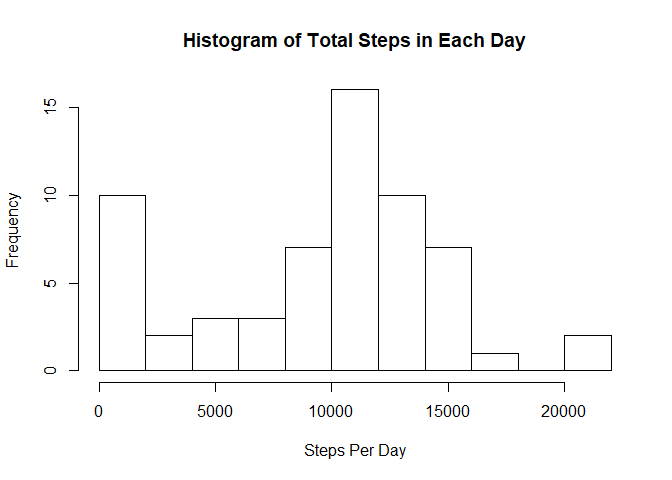
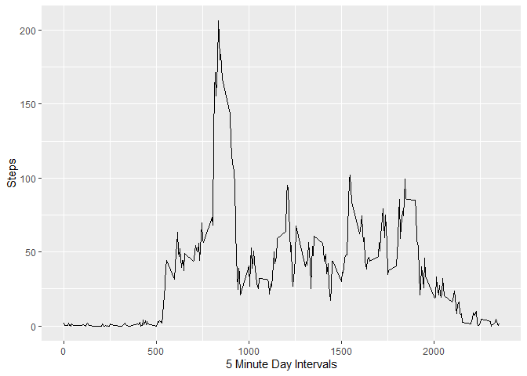
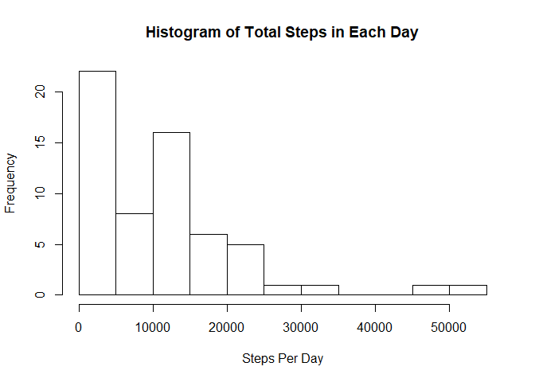
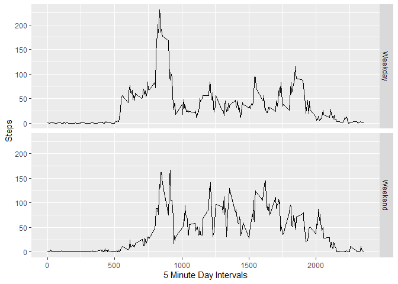

## Loading and preprocessing the data

Read in the data from the same folder, as I've extracted to that loaction.  
Format the date field as a date.  
Also, make sure the required packages are loaded.  


```r
data <- read.csv("activity.csv")
data$date <- as.Date(data$date,"%Y-%m-%d")
library(dplyr)
```

```
## 
## Attaching package: 'dplyr'
```

```
## The following objects are masked from 'package:stats':
## 
##     filter, lag
```

```
## The following objects are masked from 'package:base':
## 
##     intersect, setdiff, setequal, union
```

```r
library(ggplot2)
```

## What is mean total number of steps taken per day?

The below code plots a histogram of the steps taken in each day.  
It also works out the mean and median steps a day.  


```r
TotalStepsDay <- tapply(data$steps, data$date, sum, na.rm=TRUE)
hist(TotalStepsDay,breaks=10,xlab="Steps Per Day",main="Histogram of Total Steps in Each Day")
```

<!-- -->

```r
MeanDay <- mean(TotalStepsDay,na.rm=TRUE)
MedianDay <- median(TotalStepsDay,na.rm=TRUE)
```

The mean steps per day is 9354.2295082 and the median is 10395.  

## What is the average daily activity pattern?

The below code plots a time series plot for the average for each 5 minute interval a day.  
It also works out the interval with the maximum average steps.  


```r
DataMeanByInterval <- data %>%
    group_by(interval) %>%
    summarize(TotalSteps = mean(steps, na.rm = TRUE))
ggplot(DataMeanByInterval, aes(interval,TotalSteps)) + geom_line() + 
    xlab("5 Minute Day Intervals") + ylab("Steps")
```

<!-- -->

```r
MaxInterval <- DataMeanByInterval$interval[DataMeanByInterval$TotalSteps==max(DataMeanByInterval$TotalSteps)]
```

On average, the interval with the maximum number of steps is 835.  

## Imputing missing values

First, I check that steps is the only field with missing values.  
Then, I use the mean value for each time interval and populate the missing values according to their time interval (impute).  
Lastly, I check that there are no longer any observations missing steps.  


```r
table(is.na(data$steps))
```

```
## 
## FALSE  TRUE 
## 15264  2304
```

```r
table(is.na(data$date))
```

```
## 
## FALSE 
## 17568
```

```r
table(is.na(data$interval))
```

```
## 
## FALSE 
## 17568
```

```r
dataImpute <- merge(data,DataMeanByInterval,"interval")
dataImpute$steps <- ifelse(is.na(dataImpute$steps),dataImpute$TotalSteps,
                           dataImpute$steps)
dataImpute$date2 <- NULL; dataImpute$TotalSteps <- NULL
table(is.na(dataImpute$steps))
```

```
## 
## FALSE 
## 17568
```

With all values now populated, I can rerun the code from earlier but with an imputed dataset.  
The histogram and mean/median have changed because of this.


```r
TotalStepsDayImpute <- tapply(dataImpute$steps, data$date, sum)

hist(TotalStepsDayImpute,breaks=10,xlab="Steps Per Day",main="Histogram of Total Steps in Each Day")
```

<!-- -->

```r
MeanDay2 <- mean(TotalStepsDayImpute,na.rm=TRUE) 
MedianDay2 <- median(TotalStepsDayImpute,na.rm=TRUE)
```

The mean steps per day is 1.0766189\times 10^{4} and the median is 1.0351623\times 10^{4}.

## Are there differences in activity patterns between weekdays and weekends?

I create a new field populated with whether the date is a *weekday* or *weekend*.  
I then use this new field to plot the time series from earlier but split out by this field.  


```r
dataImpute$dayofweek <- weekdays(dataImpute$date, abbreviate=FALSE)
dataImpute$weekday <- ifelse(dataImpute$dayofweek %in% c("Saturday", "Sunday"),
                             "Weekend","Weekday")
DataMeanByIntAndDay <- dataImpute %>%
    group_by(interval,weekday) %>%
    summarize(TotalSteps = mean(steps, na.rm = TRUE))
ggplot(DataMeanByIntAndDay, aes(interval,TotalSteps)) + geom_line() + 
    facet_grid(weekday~.) + xlab("5 Minute Day Intervals") + ylab("Steps")
```

<!-- -->


